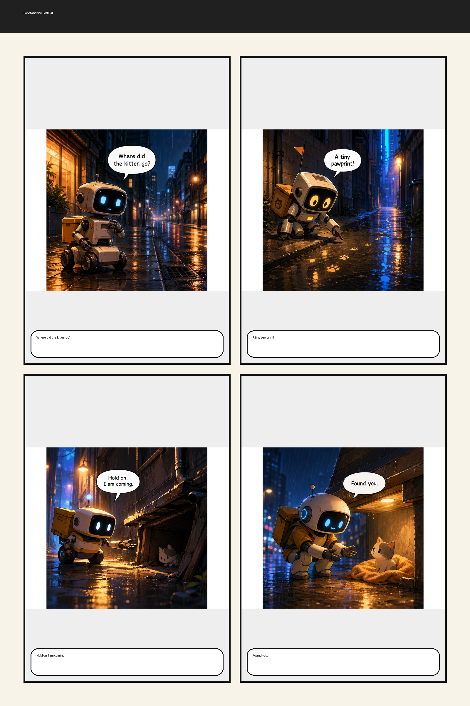
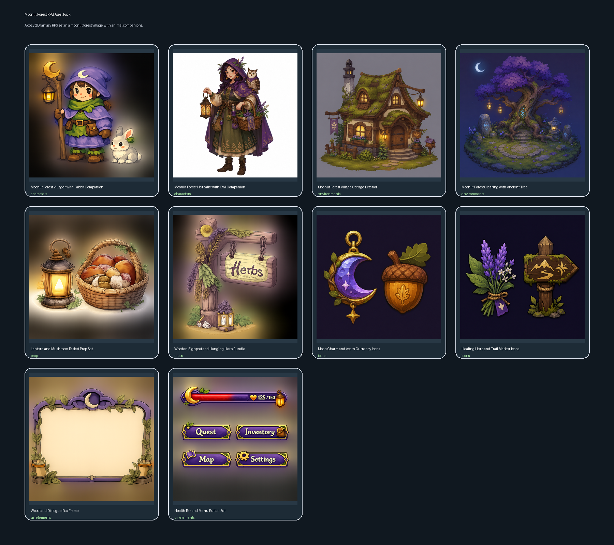
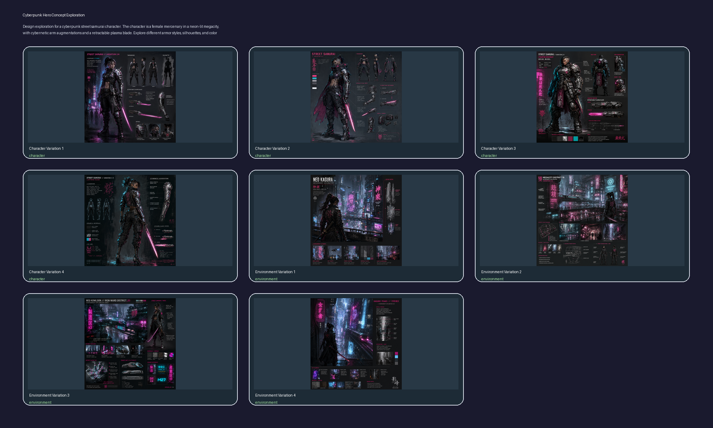

# Graphic Agent：面向 2D 视觉生成任务的可配置 Agent 框架

**代码仓库：** https://github.com/Dmax-666/2026ComputerGraphicsFinalPJ  
**课程：** 2026 春季学期计算机图形学  
**项目方向：** Agent + 图形学，2D 生成

## 摘要

本项目实现了一个面向 2D 视觉生成任务的可配置 Agent 框架 Graphic Agent。与直接调用文生图模型生成单张图片不同，本项目将复杂视觉任务拆分为任务理解、风格记忆、资产规划、提示词优化、图像生成、排版合成、视觉审稿和局部重试等多个阶段。系统通过 YAML 文件描述不同应用场景，并使用同一套 Python pipeline 执行完整流程。目前项目支持三个场景：故事转漫画页、游戏设定转 2D 素材包、概念设定探索板。在 full-agent 模式下，文本 / 视觉 API 负责风格生成、资产规划、prompt 优化、审稿和修订决策，图像 API 负责真实图片生成，本地程序负责流程控制、结构化报告保存和最终排版合成。实验结果表明，该框架能够在多个 2D 图形学任务中复用，并保留可解释的中间产物。

## 1. 引言

当前多模态生成模型已经可以根据一句提示词生成质量较高的图像。但在很多图形学任务中，我们需要的不只是“一句话生成一张图”。例如，一页漫画需要多个分镜之间保持角色一致；游戏素材包需要覆盖角色、场景、道具、图标、UI 等不同类别；概念设定板需要在同一风格下探索多个设计方向。这类任务更接近一个完整的视觉生产流程，而不是一次性生图。

因此，本项目希望实现一个可复用的视觉生成 Agent 框架。它的目标包括：

- 根据输入任务自动生成统一的视觉风格记忆；
- 将任务拆分为多个结构化视觉资产；
- 使用语言模型优化每个资产的生图 prompt；
- 调用真实图像 API 生成视觉资产；
- 使用本地 renderer 合成最终 2D 结果；
- 使用审稿 Agent 检查结果质量；
- 对有问题的资产进行局部重画，而不是整体重跑；
- 保存结构化中间报告，便于调试、展示和项目汇报。

本项目选择 2D 生成作为主要方向，因为它和课程中的图像生成、排版、视觉一致性、渲染合成等内容联系较紧密，同时也符合 Project 3 中“Agent + 图形学相关课题”的开放要求。

## 2. 相关工作

本项目的设计参考了 Project 3 说明中介绍的若干 Agent 图形学系统。

**GenPilot** 是一个用于文生图测试时 prompt 优化的多 Agent 系统。它会先分析生成图像与原始提示之间的不一致，再由提示词改进 Agent 修改 prompt，从而提升图文对齐质量。本项目借鉴了其中“审稿 - 修改 prompt - 重新生成”的思路，但将其扩展到多资产视觉任务中。

**Paper2Poster** 将学术论文自动转化为单页学术海报。它不是单纯生成图片，而是经过论文解析、内容规划、布局生成和反馈修正等阶段。这启发我们将 2D 生成任务设计成一个可审计 pipeline，而不是一次性调用模型。

**PosterForest** 强调层级多 Agent 协作和迭代优化。它通过内容 Agent 和布局 Agent 的反复协调来优化海报结果。本项目也采用了类似的迭代思想：生成初稿后，由 critic 检查问题，再由 revision controller 决定是否局部重试。

此外，Project 3 中提到的 AniMaker、Mora、LL3M 等系统也体现了类似思想：复杂图形学输出往往需要规划、生成、评价、修正多个环节协同完成。本项目聚焦于 2D 生成，并尝试用较轻量的 Python 框架实现这一过程。

## 3. 系统总体设计

Graphic Agent 分为三层：

```text
场景层：YAML 文件声明任务类型和工作流配置
工作流层：Python pipeline 执行完整 agentic loop
工具层：文本 API、视觉 / 文本审稿 API、图像 API、renderer、storage
```

full-agent 模式下的执行流程如下：

```text
输入 Task YAML
  -> 文本 API 生成 StyleGuide
  -> 文本 API 规划 AssetSpec 列表
  -> 文本 API 优化每个生图 prompt
  -> 图像 API 生成 assets/*.png
  -> 本地 renderer 合成 final.png
  -> 文本 / 视觉 API 审稿 final.png
  -> 文本 API 决定 accept / retry_assets / stop
  -> 图像 API 局部重画需要重试的资产
```

其中，本地 Python 程序负责流程调度、数据校验、文件保存、成本统计和最终图像合成。这样做的好处是，模型可以负责语义理解和视觉判断，而项目本身仍然保留稳定、可测试、可复现的工程结构。

## 4. 三个 YAML 场景设计

项目目前有三个核心场景配置，位于 `configs/scenarios/`。它们不是具体输入内容，而是定义某类视觉任务应该如何拆分、生成、合成和审稿。

### 4.1 `story_comic.yaml`：故事转漫画页

该场景用于将一个短故事生成一页漫画。

对应输入示例：

```text
examples/story_comic_robot_cat.yaml
```

当前示例讲述的是：一个小型送货机器人在下雨的霓虹夜晚寻找走丢的小猫。

流程大致为：

```text
输入短故事
-> 生成统一 StyleGuide
-> 规划角色参考图和 4 到 8 个漫画 panel
-> 为每个 panel 生成图像
-> 合成一页漫画 final.png
-> 检查叙事一致性、角色一致性、文字排版、图片尺寸和文件有效性
-> 必要时局部重画 panel
```

该场景重点展示的是多分镜之间的叙事连贯性和角色一致性。

### 4.2 `game_assets.yaml`：游戏设定转 2D 素材包

该场景用于根据游戏设定文档生成一组 2D 游戏素材。

对应输入示例：

```text
examples/game_assets_fantasy_rpg.yaml
```

场景默认生成五类素材：

```text
characters
environments
props
icons
ui_elements
```

每类默认生成 2 个资产，因此初始生成 10 张图片。最终 renderer 会将所有素材合成为一张 asset sheet。

该场景重点展示的是：在同一视觉风格下，系统能否覆盖多个游戏资产类别，并保持整体风格统一。

### 4.3 `concept_art_board.yaml`：概念设定探索板

该场景用于对一个设计主题进行多方向视觉探索。

对应输入示例：

```text
examples/concept_art_cyberpunk_hero.yaml
```

场景中包含两个 subject：

```text
character
environment
```

每个 subject 生成 4 个 variation，因此初始生成 8 张图片。最终结果是一张 concept art board，用于对比同一主题下的不同设计方向。

该场景重点展示的是：同一风格约束下的多方案探索能力。

## 5. 方法与实现

### 5.1 数据结构

项目中的主要数据结构定义在 `src/graphic_agent/schemas.py` 中：

- `VisualTask`：从输入 YAML 读取的用户任务；
- `StyleGuide`：全局风格记忆；
- `AssetSpec`：计划生成的视觉资产；
- `GeneratedAsset`：实际生成的图片及其元数据；
- `CompositionSpec`：最终合成图的布局信息；
- `CritiqueReport`：审稿结果；
- `RevisionDecision`：是否接受或重试的决策；
- `CostSummary`：token、图片生成次数、重试次数和估算成本。

使用结构化数据的原因是：Agent 之间如果只传递自由文本，后续解析和调试都会比较困难。结构化对象能让 pipeline 更稳定，也方便保存中间报告。

### 5.2 Agent 模块

项目实现了本地 fallback agent 和 LLM-backed agent 两套逻辑。

full-agent 模式下主要使用：

- `LLMStyleDirector`：调用文本 API 生成更完整的 StyleGuide；
- `LLMPlanner`：调用文本 API 规划结构化 `AssetSpec`；
- `LLMPromptRefiner`：调用文本 API 优化生图 prompt；
- `LLMCritic`：调用文本 / 视觉 API 审稿最终图；
- `LLMRevisionController`：调用文本 API 决定是否接受、停止或局部重试。

如果外部 API 返回格式不符合预期，系统会回退到本地确定性逻辑，避免整个流程直接崩溃。

### 5.3 双 API 设计

本项目使用两类 API：

```text
文本 / 视觉 API：负责 StyleGuide、Planner、Prompt Refinement、Critic、Revision
图像 API：负责根据 prompt 生成 PNG 图片
```

实际运行时通过环境变量配置：

```powershell
$env:OPENAI_API_KEY="生图 API key"
$env:OPENAI_BASE_URL="生图 API base url"

$env:OPENAI_TEXT_API_KEY="文本 / 视觉 API key"
$env:OPENAI_TEXT_BASE_URL="文本 / 视觉 API base url"
```

API key 不写入代码或 YAML，避免泄露。

此外，由于生图模型经常返回正方形图片，而不同资产需要不同尺寸，项目在保存图片前会进行等比缩放和补边，而不是直接拉伸或裁剪。这样既能通过尺寸检查，也尽量保留原图内容。

### 5.4 本地渲染

最终排版使用 Pillow 在本地完成：

- `ComicPageRenderer`：将漫画 panel 合成一页漫画；
- `AssetSheetRenderer`：将多个素材排成 asset sheet。

本地 renderer 的作用是保证最终布局可控，而不是完全依赖图像模型一次性生成整张结果。

## 6. 实验结果

我们使用 full-agent 模式分别运行了三个场景。所有结果保存在 `outputs/` 目录下。

### 6.1 故事转漫画页结果

输出目录：

```text
outputs/story_comic_full_agent/
```

运行结果：

```text
scenario: story_comic
assets: 5
rounds: 2
final score: 1.0
final decision: accept
```

第一轮生成后，critic 发现部分 panel 存在多余文字、角色一致性不足等问题。revision controller 对 4 个 panel 的 prompt 进行了重写，并触发第二轮局部重画。第二轮通过审稿。



### 6.2 游戏素材包结果

输出目录：

```text
outputs/game_assets_full_agent/
```

运行结果：

```text
scenario: game_assets
assets: 10
rounds: 3
final score: 0.84
```

该场景生成了包含角色、环境、道具、图标和 UI 元素的 asset sheet。相比漫画场景，它的初始资产数量更多，对类别覆盖和整体风格一致性的要求更高。

在开发过程中，我们发现 revision controller 在最大轮次后仍可能返回 `retry_assets`。目前代码已经增加硬约束：如果已经达到最大轮次，就不能继续要求 retry，而应返回 `stop` 或 `accept`。



### 6.3 概念设定板结果

输出目录：

```text
outputs/concept_art_full_agent/
```

运行结果：

```text
scenario: concept_art_board
assets: 8
rounds: 2
final score: 0.78
final decision: stop
```

该场景生成了角色和环境两个方向的多个视觉变体。最终结果在达到 revision 预算后停止，并返回当前最佳结果。



## 7. 分析

从实验结果来看，本项目实现的不只是简单 API 调用，而是一个较完整的多阶段 Agent 工作流。

优点包括：

- 三个不同场景共用同一套 pipeline；
- YAML 文件负责组织任务，Python 代码负责实现能力；
- 中间产物完整保存，方便解释和调试；
- prompt refinement 和 revision 能够改善部分生成问题；
- 可以只重画有问题的资产，避免每次全部重跑；
- 本地 renderer 提供稳定的最终合成方式。

目前的不足包括：

- 输出质量仍然受外部模型和 API 网关稳定性影响；
- 图像模型有时会生成不需要的文字；
- VLM 审稿返回的字段不一定完全符合项目 schema，需要做归一化和 fallback；
- 当前 renderer 较简单，排版美观性还有提升空间；
- 成本估算依赖 provider profile 中的假设值，并非严格计费结果。

## 8. 结论

本项目实现了一个面向 2D 视觉生成任务的可配置 Agent 框架。相比直接调用文生图模型，Graphic Agent 更强调“规划 - 生成 - 合成 - 审稿 - 修订”的完整流程。通过三个 YAML 场景，项目展示了同一框架在漫画页、游戏素材包和概念设定板任务中的复用能力。

后续可以继续改进的方向包括：更强的角色一致性记忆、更复杂的 2D 布局优化、更稳定的 VLM 审稿格式、多 provider 支持，以及更细粒度的成本和质量评估。

## 组员与分工

提交前请补充具体姓名和学号。

| 姓名 | 学号 | 分工 |
|---|---|---|
| TODO | TODO | 场景设计与项目方向确定 |
| TODO | TODO | Pipeline 实现与 renderer 集成 |
| TODO | TODO | API provider 接入与 full-agent 工作流实现 |
| TODO | TODO | 实验运行、报告撰写与展示材料整理 |
